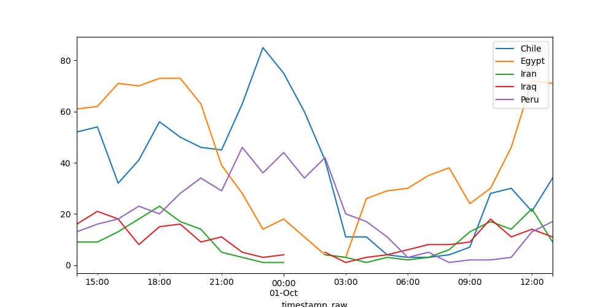

# Table of Contents

1. [Installation](#installation)
2. [Basic Command Line Options](#basic-command-line-options)
3. [CSV to JSON](#csv-to-json)
4. [CSV to SQL commands](#csv-to-sql-commands)
5. [Data Analysis Options](#data-analysis-options)
6. [Examples and Insights from the Given Dataset](#examples-and-insights-from-the-given-dataset)
7. [Unit tests](#unit-tests)
8. [Pip install](#pip-install)
9. [Docker install](#docker-install)

## Installation

```
$ git clone <>
$ cd <>
```

## Basic Command Line Options

The program has three (mutually exclusive) modes: JSON, SQL, and data analysis. Regardless of the task, this program an input file (CSV).

All modes require a CSV input file, and all but the "aggregate" option for data analysis require an output file (the results of the aggregation may be printed). The SQL option can take an .sql or .txt file, the JSON option takes a .json file, the data analysis option takes a .csv output for aggregation, and prints the output to terminal if one is not specified. The `--plot` option for analysis takes eps, jpeg, jpg, pdf, pgf, png, ps, raw, rgba, svg, svgz, tif, tiffeps, jpeg, jpg, pdf, pgf, png, ps, raw, rgba, svg, svgz, tif and tiff files as output.

```
$ python interface.py -i INPUT_FILE [-o=OUTPUT_FILE] {--sql | --json --table TABLE_NAME| --analyse} [--sql-command-size=NO_OF_BYTES] [--start=EARLIEST_DATE] [--end=LATEST_DATE] [--group-by=COLUMN_NAME] [--filter-os=OS_1,OS2] [--filter-country=COUNTRY_REGION_CITY] [--filter-by-name=COLUMN_1,NAME_A,NAME_B;COLUMN_2,NAME_C,NAME_D] [--blocksize BLOCKSIZE] [--sep SEPERATOR]
```
All the options after `{--sql | --json | --analyse}` are only used if the `--analyse` option is chosen.

## CSV to JSON

If you want to convert a CSV file into JSON, add the `-j` option to activate it. The output file can be specified with the `-o` option. 

## CSV to SQL commands

The CSV file will be turned into SQL commands that insert the data into a table if you use the `--sql` command.

Given that some SQL servers have a maximum command length (measured in memory size), I included an option to set a maximum memory size for each command. The commands will be in the same specified output file, separated by two newline characters. The option to set this is `-z` and `SQL_COMMAND_SIZE` should be specified in bytes.

The name of the table you want to insert the data into also needs to be specified, using the `-t` option. There is a sample SQL script to create an SQL table (named "Sandbox") under `samples/"sql_script_create_table.sql"` . The output script assumes that the field names are the same as the column names.

## Data Analysis Options

The program has several of options for filtering and analysing data. It will do so if you turn on the `--analysis` command. 

There are several example files of how to use the program, which can be tried by running e.g.
`python interface.py @samples/group_by.txt`

`--sep` is used to specify the separator between columns used in the CSV. It will default to ',' is left unused.

`--blocksize` is used to break up large CSV files and manage memory, by default Dask should prevent overflow. The size of the blocks is in bytes. **Dask can handle bigger file sizes than Pandas. You can try running the program with a bigger CSV to try it out.**

`--start` and `--end` are for filtering by date. It can handle any date format Pandas' `to_datetime` function can handle. An example of how such a command would work is under `samples/filter_by_time.txt`. 

`--filter-by-name` is used to filter the data based on their values for a number of columns. Each column that should be considered in the filter should be separated by a semicolon. Within each semicolon-separated clause there are comma-separated words. The first such word is the column name, and all subsequent words form a set that each row's field must be in for that row to be included. For example "device_os,android,ios;device_category,tablet" means only rows where the "device_os" is Andoid or iOS (the words are case insensitive) *and* whose"device_category" is "tablet" will be included. An example can be found in `tests/test_name_filter.txt`.

`--filter-by-country` is separate from `--filter-by-name` because `--filter-by-name` always assumes all the conditions must hold true (*and*) while this option assumes any one option will be fine (*or*). The format for `COUNTRY_REGION_CITY` is comma-separated terms of the format `country-region-city`, `country--`, `country-region-`, `-region-city`, `--city`, etc. 

So it can be "the row must be in this country or that region". It also allows for country and region to be considered, so it can be "must be downloaded in the Piura region in Peru, or Cuba" (peru-piura,cuba)

`--group-by` lets you specify a comma-separated list of fields to group the results by. If you do not also choose the `--plot` option, it will output a CSV file with the count of the number of rows in each category. If the `--plot` option is also chosen, there will be several lines on the plot, one for each category. An example of aggregation would be in `samples/grouup_by.txt` where `-g=geo_country,geo_region` means the data is grouped by country and region. 

`--plot` will produce a frequency line plot that will be output to a png, tif, etc. file. An example of a grouped frequency line plot can be found by running `samples/timezones.txt`. An examples of a ungrouped frequency line plot can be found by running `samples/plot.txt`.

`--level` is used with `--plot` to determine the level of the sampling. The options available can be found [here](https://pandas.pydata.org/pandas-docs/stable/user_guide/timeseries.html#offset-aliases). Examples are in `samples/timezones.txt` and `samples/plot.txt`.

## Examples and Insights from the Given Dataset

### Commands and their outputs

By running the right commands, it is possible to extract informative aggregations from the data.

For example::

<details><summary>Countries</summary>
<p>

```
$ python interface.py @samples/countries.txt
   geo_country  size  percentage
16       India  4047   25.357143
8        China  2593   16.246867
5       Brazil  2302   14.423559
19       Italy  2054   12.869674
32       Spain  1216    7.619048
10       Egypt   991    6.209273
7        Chile   856    5.363409
30        Peru   477    2.988722
18        Iraq   224    1.403509
17        Iran   210    1.315789
27       Nepal   181    1.134085
20       Japan   161    1.008772
22        Laos   101    0.632832
34       Syria    98    0.614035
29        Oman    74    0.463659
23       Libya    68    0.426065
31       Qatar    65    0.407268
36       Yemen    58    0.363409
13       Ghana    28    0.175439
21       Kenya    21    0.131579
0       Angola    17    0.106516
2       Belize    14    0.087719
24       Macao    14    0.087719
9         Cuba    13    0.081454
33       Sudan    12    0.075188
15       Haiti    11    0.068922
12       Gabon    10    0.062657
26       Malta    10    0.062657
11        Fiji     6    0.037594
25        Mali     6    0.037594
3        Benin     5    0.031328
14        Guam     5    0.031328
35        Togo     5    0.031328
6         Chad     2    0.012531
4       Bhutan     2    0.012531
1        Aruba     2    0.012531
28       Niger     1    0.006266

```
</p>
</details>

We learn the number of downloads in the last 24 hours (the data given only covers 24 hours) in each nation. The top ten nations with the most downloads are, in order: India, China, Brazil, Italy, Spain, Egypt, Chile, Peru, Iraq, Iran. By comparison, the ten most populous nations in the world are: China, India, United States, Indonesia, Pakistan, Brazil, Nigeria, Bangladesh, Russia, Mexico.

It may be useful to look at the cities with the most downloads in the two top nations:

<details><summary>Cities in China</summary>
<p>

```
$ python interface.py @samples/cities_in_china.txt
          geo_city  size  percentage
0                    122    4.704975
172       Shanghai    98    3.779406
62       Guangzhou    86    3.316622
17         Beijing    80    3.085229
69        Hangzhou    62    2.391053
33         Chengdu    57    2.198226
255      Zhengzhou    53    2.043965
190         Suzhou    52    2.005399
206        Wenzhou    51    1.966834
181       Shenzhen    46    1.774007
211          Xi'an    44    1.696876
160        Qingdao    40    1.542615
143        Nanjing    39    1.504049
149         Ningbo    39    1.504049
193        Taizhou    38    1.465484
37       Chongqing    38    1.465484
58          Fuzhou    37    1.426919
112        Kunming    35    1.349788
207          Wuhan    34    1.311223
27        Changsha    33    1.272657
71          Harbin    33    1.272657
195        Tianjin    30    1.156961
212         Xiamen    30    1.156961
51        Dongguan    30    1.156961
201         Urumqi    26    1.002700
24       Changchun    25    0.964134
100          Jinan    24    0.925569
141       Nanchang    24    0.925569
209           Wuxi    22    0.848438
180       Shenyang    21    0.809873
88         Huizhou    21    0.809873
125          Linyi    19    0.732742
55          Foshan    18    0.694177
167       Quanzhou    17    0.655611
73           Hefei    16    0.617046
116        Lanzhou    16    0.617046
236        Yichang    16    0.617046
80          Hohhot    16    0.617046
192        Taiyuan    15    0.578481
29       Changzhou    15    0.578481
221       Xinxiang    15    0.578481
12         Baoding    14    0.539915
147        Nanyang    14    0.539915
76        Hengyang    13    0.501350
144        Nanning    13    0.501350
132        Luoyang    13    0.501350
107       Jiujiang    13    0.501350
103         Jinhua    13    0.501350
259        Zhoukou    13    0.501350
20           Bijie    13    0.501350
194       Tangshan    12    0.462784
146        Nantong    12    0.462784
145        Nanping    12    0.462784
233       Yangzhou    12    0.462784
173       Shangqiu    12    0.462784
257      Zhongshan    11    0.424219
64          Guilin    11    0.424219
189         Suqian    11    0.424219
102       Jingzhou    11    0.424219
227         Xuzhou    11    0.424219
59         Ganzhou    10    0.385654
202        Weifang    10    0.385654
72           Hechi    10    0.385654
178       Shaoxing    10    0.385654
68          Handan    10    0.385654
57          Fuyang    10    0.385654
252      Zhanjiang    10    0.385654
97         Jiaxing    10    0.385654
65         Guiyang     9    0.347088
104         Jining     9    0.347088
150         Ningde     9    0.347088
6           Anshan     9    0.347088
99           Jilin     9    0.347088
93           Ji'an     8    0.308523
264           Zibo     8    0.308523
245       Yuncheng     8    0.308523
115       Langfang     8    0.308523
234         Yantai     8    0.308523
157    Qiandongnan     8    0.308523
158        Qiannan     8    0.308523
86       Huanggang     8    0.308523
191         Tai'an     8    0.308523
266          Zunyi     8    0.308523
81          Honghe     8    0.308523
43          Daqing     8    0.308523
8           Anyang     7    0.269958
208           Wuhu     7    0.269958
235          Yibin     7    0.269958
119    Lianyungang     7    0.269958
162       Qingyuan     7    0.269958
179       Shaoyang     7    0.269958
23        Cangzhou     7    0.269958
251      Zhangzhou     7    0.269958
256      Zhenjiang     7    0.269958
136        Maoming     7    0.269958
96         Jiaozuo     7    0.269958
98         Jieyang     7    0.269958
215      Xiangyang     6    0.231392
18          Bengbu     6    0.231392
83         Huai'an     6    0.231392
49          Dezhou     6    0.231392
237         Yichun     6    0.231392
203         Weihai     6    0.231392
45          Dazhou     6    0.231392
25         Changde     6    0.231392
168         Qujing     6    0.231392
182   Shijiazhuang     6    0.231392
21         Binzhou     6    0.231392
131          Lu'an     6    0.231392
35         Chifeng     6    0.231392
244          Yulin     6    0.231392
92             Ili     6    0.231392
262      Zhumadian     6    0.231392
90      Hulun Buir     6    0.231392
263        Zhuzhou     5    0.192827
41          Dalian     5    0.192827
169         Quzhou     5    0.192827
31        Chaozhou     5    0.192827
222        Xinyang     5    0.192827
153   Pingdingshan     5    0.192827
170         Rizhao     5    0.192827
22          Bozhou     5    0.192827
95        Jiangmen     5    0.192827
78            Heze     5    0.192827
53           Enshi     5    0.192827
139       Mianyang     5    0.192827
253       Zhaoqing     5    0.192827
217       Xianyang     5    0.192827
243        Yueyang     5    0.192827
231       Yancheng     5    0.192827
120      Liaocheng     5    0.192827
60           Garze     5    0.192827
126         Lishui     5    0.192827
197        Tonghua     4    0.154261
151          Ordos     4    0.154261
91          Huzhou     4    0.154261
105       Jinzhong     4    0.154261
196        Tieling     4    0.154261
156         Puyang     4    0.154261
261         Zhuhai     4    0.154261
148       Neijiang     4    0.154261
26         Changji     4    0.154261
30        Chaoyang     4    0.154261
238       Yinchuan     4    0.154261
163    Qinhuangdao     4    0.154261
32         Chengde     4    0.154261
121       Liaoyang     4    0.154261
165        Qiqihar     4    0.154261
61       Guangyuan     4    0.154261
230        Yanbian     4    0.154261
248      Zaozhuang     4    0.154261
54   Fangchenggang     4    0.154261
219        Xingtai     4    0.154261
127     Liupanshui     4    0.154261
176        Shanwei     4    0.154261
183         Shiyan     4    0.154261
225      Xuancheng     4    0.154261
140     Mudanjiang     4    0.154261
174       Shangrao     4    0.154261
39         Chuzhou     4    0.154261
77          Heyuan     4    0.154261
239        Yingkou     3    0.115696
265         Zigong     3    0.115696
184   Shuangyashan     3    0.115696
188        Suizhou     3    0.115696
240        Yingtan     3    0.115696
223        Xinzhou     3    0.115696
34        Chenzhou     3    0.115696
247           Yuxi     3    0.115696
220         Xining     3    0.115696
260       Zhoushan     3    0.115696
229         Yan'an     3    0.115696
242       Yongzhou     3    0.115696
5           Anqing     3    0.115696
228          Ya'an     3    0.115696
210        Wuzhong     3    0.115696
16        Bayingol     3    0.115696
250    Zhangjiakou     3    0.115696
19           Benxi     3    0.115696
175        Shantou     3    0.115696
128        Liuzhou     3    0.115696
94         Jiamusi     3    0.115696
117         Leshan     3    0.115696
47           Deqen     3    0.115696
123         Linfen     3    0.115696
111        Kashgar     3    0.115696
48          Deyang     3    0.115696
66          Haikou     3    0.115696
38        Chongzuo     3    0.115696
138        Meizhou     3    0.115696
129        Longyan     3    0.115696
134        Lvliang     3    0.115696
40            Dali     3    0.115696
84         Huaihua     3    0.115696
85         Huainan     3    0.115696
46          Dehong     3    0.115696
118          Lhasa     2    0.077131
224  Xishuangbanna     2    0.077131
56          Fushun     2    0.077131
130          Loudi     2    0.077131
226        Xuchang     2    0.077131
63         Guigang     2    0.077131
10           Baise     2    0.077131
114          Laiwu     2    0.077131
135      Ma'anshan     2    0.077131
110        Kaifeng     2    0.077131
108        Jiuquan     2    0.077131
106        Jinzhou     2    0.077131
101       Jincheng     2    0.077131
75        Hengshui     2    0.077131
3             Alxa     2    0.077131
89         Huludao     2    0.077131
87       Huangshan     2    0.077131
2            Altay     2    0.077131
216       Xianning     2    0.077131
133         Luzhou     2    0.077131
166          Qoqek     2    0.077131
50          Dingxi     2    0.077131
200        Ulanqab     2    0.077131
164        Qinzhou     2    0.077131
42         Dandong     2    0.077131
155         Putian     2    0.077131
213       Xiangtan     2    0.077131
44          Datong     2    0.077131
198       Tongliao     2    0.077131
199        Tongren     2    0.077131
52        Dongying     2    0.077131
142       Nanchong     2    0.077131
186       Songyuan     2    0.077131
159      Qianxinan     2    0.077131
15       Bayan Nur     2    0.077131
177       Shaoguan     2    0.077131
74           Heihe     1    0.038565
249    Zhangjiajie     1    0.038565
7           Anshun     1    0.038565
70        Hanzhong     1    0.038565
214        Xiangxi     1    0.038565
161       Qingyang     1    0.038565
254       Zhaotong     1    0.038565
4           Ankang     1    0.038565
258       Zhongwei     1    0.038565
171        Sanming     1    0.038565
79          Hezhou     1    0.038565
187         Suihua     1    0.038565
82           Hotan     1    0.038565
185       Shuozhou     1    0.038565
67           Haixi     1    0.038565
241         Yiyang     1    0.038565
246          Yunfu     1    0.038565
204         Weinan     1    0.038565
218        Xiaogan     1    0.038565
1              Aba     1    0.038565
14          Baotou     1    0.038565
137        Meishan     1    0.038565
205        Wenshan     1    0.038565
13           Baoji     1    0.038565
124         Linxia     1    0.038565
122        Lincang     1    0.038565
28        Changzhi     1    0.038565
152         Panjin     1    0.038565
232      Yangjiang     1    0.038565
11         Baishan     1    0.038565
9         Baicheng     1    0.038565
113         Laibin     1    0.038565
154          Pu'er     1    0.038565
109           Jixi     1    0.038565
36         Chizhou     1    0.038565

```
</p>
</details>

<details><summary>Cities in India</summary>
<p>

```
$ python interface.py @samples/cities_in_india.txt
                       geo_city  size  percentage
42                    Hyderabad   473   11.687670
0                                 451   11.144057
23                      Chennai   446   11.020509
3                     Ahmedabad   298    7.363479
71                       Mumbai   264    6.523351
17                    Bengaluru   261    6.449222
88                         Pune   202    4.991352
65                      Lucknow   130    3.212256
22                   Chandigarh   121    2.989869
61                      Kolkata   120    2.965159
46                       Jaipur   117    2.891030
44                       Indore   105    2.594514
24                   Coimbatore    87    2.149741
2                          Agra    83    2.050902
84                        Patna    81    2.001483
59                        Kochi    76    1.877934
78                    New Delhi    74    1.828515
20                  Bhubaneswar    47    1.161354
119               Visakhapatnam    44    1.087225
38                     Guwahati    41    1.013096
66                     Ludhiana    38    0.938967
82                      Panipat    33    0.815419
104                       Surat    29    0.716580
26                     Dehradun    24    0.593032
74                       Nagpur    23    0.568322
19                       Bhopal    23    0.568322
63                    Kozhikode    18    0.444774
79                        Noida    14    0.345935
92                       Ranchi    14    0.345935
106          Thiruvananthapuram    12    0.296516
98                 Secunderabad    12    0.296516
1                      Agartala    11    0.271806
91                       Rajkot    11    0.271806
118                  Vijayawada    10    0.247097
89                       Raipur     9    0.222387
112                    Vadodara     9    0.222387
29                     Durgapur     9    0.222387
105                       Thane     9    0.222387
76                  Navi Mumbai     8    0.197677
67                    Mangaluru     8    0.197677
120                    Warangal     7    0.172968
36                       Guntur     7    0.172968
41                        Hisar     6    0.148258
48                        Jammu     6    0.148258
100                      Shimla     6    0.148258
72                       Mysuru     6    0.148258
30                    Faridabad     6    0.148258
51                      Jodhpur     6    0.148258
69                       Meerut     6    0.148258
77                      Nellore     5    0.123548
47                    Jalandhar     5    0.123548
107                    Thrissur     5    0.123548
87                   Puducherry     5    0.123548
93                       Rohtak     4    0.098839
80                       Ongole     4    0.098839
7                     Ambernath     4    0.098839
28                     Dombivli     4    0.098839
8                      Amritsar     4    0.098839
37                      Gurgaon     4    0.098839
108             Tiruchirappalli     4    0.098839
85             Pimpri-Chinchwad     3    0.074129
110                    Tiruppur     3    0.074129
56                       Karnal     3    0.074129
33                    Ghaziabad     3    0.074129
16                     Bathinda     3    0.074129
32                  Gandhinagar     3    0.074129
14                     Badlapur     3    0.074129
53                       Kalyan     3    0.074129
116                 Vasai-Virar     3    0.074129
109                 Tirunelveli     2    0.049419
73                    Nagercoil     2    0.049419
83               Pathanamthitta     2    0.049419
86                    Prayagraj     2    0.049419
75                       Nashik     2    0.049419
10                    Anantapur     2    0.049419
103                     Sonipat     2    0.049419
39                      Gwalior     2    0.049419
70               Mira Bhayandar     2    0.049419
12                   Aurangabad     2    0.049419
68                       Margao     2    0.049419
45                     Jabalpur     2    0.049419
31                   Gandhidham     2    0.049419
64                      Kurnool     2    0.049419
62                         Kota     2    0.049419
101                    Siliguri     2    0.049419
114                        Vapi     2    0.049419
54                       Kanpur     2    0.049419
13                        Baddi     2    0.049419
102                     Solapur     1    0.024710
4                     Alappuzha     1    0.024710
5                       Aligarh     1    0.024710
9                         Anand     1    0.024710
117                  Vijayapura     1    0.024710
111                  Ulhasnagar     1    0.024710
6                  Ambala Cantt     1    0.024710
113                      Valsad     1    0.024710
115                    Varanasi     1    0.024710
99                     Shillong     1    0.024710
81                       Panaji     1    0.024710
97                        Salem     1    0.024710
96   Sahibzada Ajit Singh Nagar     1    0.024710
43                       Imphal     1    0.024710
49                     Jamnagar     1    0.024710
50                   Jamshedpur     1    0.024710
52                     Kakinada     1    0.024710
55                    Karaikudi     1    0.024710
57                      Khammam     1    0.024710
58                    Kharagpur     1    0.024710
35                     Gulbarga     1    0.024710
34                Greater Noida     1    0.024710
27                    Dibrugarh     1    0.024710
25                      Cuttack     1    0.024710
21                      Bikaner     1    0.024710
18                    Bhavnagar     1    0.024710
40                     Haridwar     1    0.024710
15                     Bareilly     1    0.024710
90                  Rajahmundry     1    0.024710
11                   Ankleshwar     1    0.024710
94                     Rourkela     1    0.024710
95                        Sagar     1    0.024710
60                     Kolhapur     1    0.024710

```
</p>
</details>

We learn that the most downloads in China are not recorded as any specific city, and the city with the most downloads is Shanghai, with 98 out of the total 2593 (3.8%) downloads in China. This makes sense, since Shanghai was the most populous city in China as of the 2010 census, with 1.5% of the nation's total population. This means the city is vastly over-represented in terms of number of downloads. This makes sense, as people living in cities are more likely to be able to afford higher-end smartphones for games.

The city with the most downloads in India is Hyderabad, which is only the fourth most populous city in India, with 0.9% of the nation's total population as of 2019. In comparison, it made up 11.7% of the number of downloads from India in the 24 hours given.

<details><summary>sku</summary>
<p>

```
$ python interface.py @samples/sku.txt
           sku   size  percentage
0  Google Play  13090     81.8125
1          iOS   2910     18.1875
```
</p>
</details>

This isn't too complicated, the vast majority (81.8%) of the users obtained their purchase token through Google Play.

<details><summary>Install Source</summary>
<p>

```
$ python interface.py @samples/install_source.txt
                                          install_source   size  percentage
26                                   com.android.vending  10021    62.63125
70                                                iTunes   2828    17.67500
34                   com.google.android.packageinstaller   1182     7.38750
72                                        manual_install    909     5.68125
25                          com.android.packageinstaller    605     3.78125
46                             com.miui.packageinstaller    133     0.83125
69                                    com.xiaomi.mipicks     62     0.38750
67                                     com.xiaomi.market     55     0.34375
28                                   com.baidu.searchbox     15     0.09375
65                                 com.xiaomi.gamecenter     14     0.08750
53                  com.samsung.android.packageinstaller     13     0.08125
40                               com.lenovo.anyshare.gps     11     0.06875
71                                   ir.mservices.market     11     0.06875
24                                    com.android.chrome     11     0.06875
50                                       com.oppo.market      9     0.05625
44                                      com.meizu.mstore      8     0.05000
56                             com.sec.android.easyMover      5     0.03125
55                       com.sec.android.app.samsungapps      5     0.03125
32                               com.coloros.filemanager      5     0.03125
38                                 com.huluxia.gametools      5     0.03125
64                                com.wandoujia.phoenix2      5     0.03125
63                                     com.vivo.appstore      5     0.03125
75                                 ru.YDTbbyxF.JTbYkiOgF      4     0.02500
21                                             cn.xender      3     0.01875
61                                     com.uc.browser.en      3     0.01875
35                          com.halfbrick.jetpackjoyride      3     0.01875
31                                      com.byfen.market      3     0.01875
54                            com.samsung.android.scloud      2     0.01250
42                                  com.m4399.gamecenter      2     0.01250
41                                       com.lion.market      2     0.01250
52                                   com.qihoo.gameunion      2     0.01250
37                                             com.huati      2     0.01250
58                                          com.tcl.live      2     0.01250
66                             com.xiaomi.gamecenter.pad      2     0.01250
33                                     com.gh.gamecenter      2     0.01250
29                                     com.baoruan.lewan      2     0.01250
27  com.android.vending.billing.InAppBillingService.COIN      2     0.01250
51                                      com.pp.assistant      2     0.01250
13                                                   303      2     0.01250
23                                   com.android.browser      2     0.01250
22                                     com.UCMobile.intl      2     0.01250
62                                          com.uptodown      2     0.01250
74                                 ru.MhEnBwnP.femjCPVFT      1     0.00625
59                                       com.tcl.live.hd      1     0.00625
73                                           net.appcake      1     0.00625
57                                com.sogou.activity.src      1     0.00625
68                                     com.xiaomi.midrop      1     0.00625
76                                 ru.yFarPSsi.lSWLCBgGE      1     0.00625
60                                       com.tencent.mtt      1     0.00625
77                                                   浏览器      1     0.00625
0                                                    104      1     0.00625
39                                     com.kkptech.kkpsy      1     0.00625
49                             com.oneplus.backuprestore      1     0.00625
14                                                   313      1     0.00625
2                                                   1051      1     0.00625
3                                                   1168      1     0.00625
4                                                    140      1     0.00625
5                                                    158      1     0.00625
6                                                    181      1     0.00625
7                                                     19      1     0.00625
8                                                      2      1     0.00625
9                                                     21      1     0.00625
10                                                    22      1     0.00625
11                                                    24      1     0.00625
12                                                    30      1     0.00625
15                                                   409      1     0.00625
48                                 com.mofirst.playstore      1     0.00625
16                                                    68      1     0.00625
17                                                   866      1     0.00625
18                                                    97      1     0.00625
19                                   cn.niucoo.niucooapp      1     0.00625
20                                   cn.niuxin.niucooapp      1     0.00625
30                    com.bluestacks.BstCommandProcessor      1     0.00625
36                             com.hicloud.android.clone      1     0.00625
1                                                   1048      1     0.00625
43                            com.meizu.flyme.gamecenter      1     0.00625
45                                  com.miui.cloudbackup      1     0.00625
47                                    com.mobile.indiapp      1     0.00625
78                                                   葫芦侠      1     0.00625

```
</p>
</details>

Again, not too complicated. The majority (62.6%) of the activity came from users that installed through "com.android.vending", followed by "iTunes" (17.7%), then by "com.google.android.packageinstaller" (7.4%). This matches the earlier point that most users obtained their purchase token through Google Play.

<details><summary>UA Source</summary>
<p>

```
$ python interface.py @samples/ua_source.txt
     ua_source  size  percentage
4  google-play  9406    58.78750
0     (direct)  6518    40.73750
2     firebase    72     0.45000
3       google     2     0.01250
1  apkpure.com     1     0.00625
5      youtube     1     0.00625
```
</p>
</details>

<details><summary>Device Category</summary>
<p>

```
$ python interface.py @samples/device_category.txt
  device_category   size  percentage
0          mobile  14152       88.45
1          tablet   1848       11.55
```
</p>
</details>

Most of the users are on mobile (88.45%) rather than tablet (11.55%).

<details><summary>Device Brand Name</summary>
<p>

```
$ python interface.py @samples/device_brand_name.txt
    device_brand_name  size  percentage
94            Samsung  4738   30.864439
8               Apple  2910   18.956420
39             Huawei  1977   12.878640
126            Xiaomi  1491    9.712722
53                 LG   622    4.051853
71           Motorola   584    3.804312
120              Vivo   575    3.745684
78               OPPO   542    3.530715
60             Lenovo   275    1.791414
80            OnePlus   179    1.166048
5             Alcatel   126    0.820793
76              Nokia   117    0.762165
93             Realme   105    0.683995
102              Sony    99    0.644909
10               Asus    99    0.644909
43            Infinix    96    0.625366
56               Lava    62    0.403882
36                HTC    59    0.384340
110             Tecno    50    0.325712
32             Gionee    49    0.319197
68           Micromax    48    0.312683
122              Wiko    42    0.273598
15                 BQ    41    0.267084
72         Multilaser    41    0.267084
131               ZTE    36    0.234512
67              Meizu    21    0.136799
33             Google    19    0.123770
17          Blackview    17    0.110742
135              itel    15    0.097714
81               Oppo    14    0.091199
58               LeTV    13    0.084685
45              Intex    13    0.084685
6              Amazon    12    0.078171
54                LYF    12    0.078171
13                BLU    11    0.071657
121          Vodafone    11    0.071657
42            InFocus    10    0.065142
133              iNew     9    0.058628
132             iBall     9    0.058628
23            Coolpad     9    0.058628
83          Panasonic     8    0.052114
0               10.or     8    0.052114
61            Lephone     7    0.045600
3                Acer     7    0.045600
48            Karbonn     7    0.045600
79                OWN     7    0.045600
70          Mobiistar     6    0.039085
38                How     5    0.032571
127              Xolo     5    0.032571
96              Sharp     4    0.026057
22              Comio     4    0.026057
2                 ANS     3    0.019543
57              LeEco     3    0.019543
74             Neffos     3    0.019543
18            Bmobile     3    0.019543
52            Kyocera     3    0.019543
19                CAT     3    0.019543
35                HOW     3    0.019543
87           Positivo     3    0.019543
95            Sanemax     2    0.013028
75           Neuimage     2    0.013028
103      SonyEricsson     2    0.013028
106          Symphony     2    0.013028
66              Meitu     2    0.013028
82            Oukitel     2    0.013028
108             Tanix     2    0.013028
118              Vido     2    0.013028
28           Elephone     2    0.013028
116              VOTO     2    0.013028
64            Magicon     2    0.013028
125             Xgody     2    0.013028
16              Bitel     2    0.013028
134        iku-mobile     2    0.013028
9              Archos     2    0.013028
117          Videocon     2    0.013028
115           Umidigi     2    0.013028
7                Ampe     2    0.013028
59             Leagoo     2    0.013028
63              MStar     2    0.013028
21       China Mobile     2    0.013028
130            Yuntab     1    0.006514
136           karbonn     1    0.006514
137           myPhone     1    0.006514
104            Storex     1    0.006514
101          Softbank     1    0.006514
105             Sugar     1    0.006514
113               UMI     1    0.006514
107           TP-Link     1    0.006514
129                YU     1    0.006514
109               Tcl     1    0.006514
128            Xtreme     1    0.006514
124            X-TIGI     1    0.006514
123              X-BO     1    0.006514
119            Vigica     1    0.006514
99           Smartron     1    0.006514
111      Timing Power     1    0.006514
114           Ulefone     1    0.006514
112             U Box     1    0.006514
100          SoftBank     1    0.006514
69             Mirage     1    0.006514
98          Smartisan     1    0.006514
27                EKS     1    0.006514
41              Iball     1    0.006514
40               IPPO     1    0.006514
37                HTM     1    0.006514
34               Gree     1    0.006514
31              Giada     1    0.006514
30             Geotel     1    0.006514
29          Essential     1    0.006514
26             Doogee     1    0.006514
46               Itel     1    0.006514
25               Dell     1    0.006514
24          Crosscall     1    0.006514
20             Celkon     1    0.006514
14             BLUBOO     1    0.006514
12              Azumi     1    0.006514
11              Avvio     1    0.006514
4               Advan     1    0.006514
44             InnJoo     1    0.006514
47              Jiake     1    0.006514
97               Sico     1    0.006514
84            Philips     1    0.006514
92              Reach     1    0.006514
91                RCA     1    0.006514
90          Qihoo 360     1    0.006514
89               Qbex     1    0.006514
88             Primux     1    0.006514
86             Poptel     1    0.006514
85            Pioneer     1    0.006514
77                Nuu     1    0.006514
49           Kenxinda     1    0.006514
73            Navcity     1    0.006514
1                 360     1    0.006514
65           Mediacom     1    0.006514
62            Logicom     1    0.006514
55              Lanix     1    0.006514
51              Konka     1    0.006514
50           KingSing     1    0.006514
138              true     1    0.006514
```
</p>
</details>

Most of the users are on Samsung (30.9%), Apple (19.0%), Huawei (12.9%), or Xiaomi devices (9.7%). This matches the earlier point about the nations users tend to be in. There is a sizeable minority of Chinese users.

<details><summary>Device OS</summary>
<p>

```
$ python interface.py @samples/device_os.txt
  device_os   size  percentage
0   ANDROID  13090     81.8125
1       IOS   2910     18.1875
```
</p>
</details>

The vast majority of users use some form on Android (81.8%), which matches our previous observations about installation source and phone brands.

<details><summary>Ad Tracking</summary>
<p>

```
$ python interface.py @samples/is_limited_ad_tracking.txt
  is_limited_ad_tracking   size  percentage
0                     No  15660      97.875
1                    Yes    340       2.125
```
</p>
</details>

Interestingly, the overwhelming majority (97.9%) of users allow ad tracking, which should make the data obtained from the tracking reasonably representative.

<details><summary>Device Language</summary>
<p>

```
$ python interface.py @samples/device_language.txt
    device_language  size  percentage
153           pt-br  2266    14.16250
131           it-it  1923    12.01875
91            en-us  1830    11.43750
58            en-gb  1685    10.53125
178      zh-hans-cn  1346     8.41250
100           es-es  1282     8.01250
172           zh-cn  1131     7.06875
65            en-in  1093     6.83125
106           es-us   623     3.89375
9             ar-eg   593     3.70625
2             ar-ae   417     2.60625
98            es-cl   268     1.67500
105           es-pe   138     0.86250
110           fa-ir   110     0.68750
97            es-ar    95     0.59375
165           th-th    86     0.53750
137           ja-jp    83     0.51875
12            ar-iq    78     0.48750
173         zh-hans    62     0.38750
47            en-au    48     0.30000
154           pt-pt    45     0.28125
114           fr-fr    43     0.26875
103           es-mx    37     0.23125
122           hi-in    31     0.19375
28            ar-ye    29     0.18125
18            ar-ly    29     0.18125
159           ru-ru    26     0.16250
56            en-eg    25     0.15625
30            ca-es    22     0.13750
20            ar-om    22     0.13750
35            de-de    18     0.11250
66            en-iq    17     0.10625
21            ar-qa    16     0.10000
54            en-cn    16     0.10000
67            en-ir    16     0.10000
52            en-ca    15     0.09375
24            ar-sy    13     0.08125
39               en    12     0.07500
34            de-ch    12     0.07500
79            en-nz    12     0.07500
121           gu-in    11     0.06875
185      zh-hans-us    11     0.06875
82            en-qa    11     0.06875
186      zh-hant-cn    11     0.06875
180      zh-hans-hk     9     0.05625
189      zh-hant-mo     9     0.05625
41            en-ae     8     0.05000
42            en-af     8     0.05000
142           lo-la     8     0.05000
22            ar-sa     8     0.05000
188      zh-hant-hk     7     0.04375
57            en-es     7     0.04375
27            ar-us     7     0.04375
16            ar-kw     7     0.04375
133           it-sm     7     0.04375
156           ro-ro     6     0.03750
11            ar-il     6     0.03750
80            en-om     6     0.03750
70            en-jp     6     0.03750
78            en-np     6     0.03750
183      zh-hans-jp     5     0.03125
68            en-it     5     0.03125
124              it     4     0.02500
62            en-hk     4     0.02500
63            en-ie     4     0.02500
93            en-za     4     0.02500
164           th-la     4     0.02500
128           it-de     4     0.02500
15            ar-jo     4     0.02500
150           pl-pl     4     0.02500
53            en-cl     4     0.02500
85            en-sg     4     0.02500
152           pt-ao     3     0.01875
84            en-sa     3     0.01875
94               es     3     0.01875
95           es-419     3     0.01875
51            en-bz     3     0.01875
74            en-mo     3     0.01875
73            en-ly     3     0.01875
46            en-as     3     0.01875
167           tr-tr     3     0.01875
169           uk-ua     3     0.01875
146           nb-no     3     0.01875
171           vi-vn     3     0.01875
143           lt-lt     3     0.01875
136              ja     2     0.01250
123           in-id     2     0.01250
10            ar-et     2     0.01250
8             ar-dz     2     0.01250
111           fa-us     2     0.01250
134           it-us     2     0.01250
129           it-gb     2     0.01250
126           it-be     2     0.01250
127           it-ch     2     0.01250
108           es-ve     2     0.01250
193           zh-tw     2     0.01250
5             ar-aw     2     0.01250
77            en-my     2     0.01250
1               ar-     2     0.01250
81            en-ph     2     0.01250
50            en-br     2     0.01250
170           vi-jp     2     0.01250
175      zh-hans-au     2     0.01250
176      zh-hans-aw     2     0.01250
177      zh-hans-ca     2     0.01250
179      zh-hans-gb     2     0.01250
76            en-mt     2     0.01250
60            en-gh     2     0.01250
182      zh-hans-it     2     0.01250
184      zh-hans-tw     2     0.01250
25            ar-tn     2     0.01250
161           ta-in     2     0.01250
23            ar-sd     2     0.01250
14            ar-it     2     0.01250
141           ku-iq     1     0.00625
181      zh-hans-in     1     0.00625
140           ko-us     1     0.00625
174      zh-hans-al     1     0.00625
139           ko-cn     1     0.00625
187      zh-hant-es     1     0.00625
145           ms-my     1     0.00625
144           mr-in     1     0.00625
163           th-gr     1     0.00625
158           ru-eg     1     0.00625
155           ro-md     1     0.00625
160           sv-se     1     0.00625
190      zh-hant-tt     1     0.00625
191      zh-hant-tw     1     0.00625
162           te-in     1     0.00625
151             pt-     1     0.00625
157           ru-by     1     0.00625
192           zh-hk     1     0.00625
166           th-us     1     0.00625
149           pa-in     1     0.00625
138           ja-mo     1     0.00625
148           nl-nl     1     0.00625
147           nl-br     1     0.00625
168           uk-es     1     0.00625
0                ar     1     0.00625
135           it-xk     1     0.00625
132           it-jp     1     0.00625
64            en-il     1     0.00625
61            en-gu     1     0.00625
59            en-gd     1     0.00625
55            en-de     1     0.00625
49            en-ax     1     0.00625
48            en-aw     1     0.00625
45            en-ar     1     0.00625
44            en-aq     1     0.00625
43            en-ag     1     0.00625
40              en-     1     0.00625
38            de-us     1     0.00625
37            de-it     1     0.00625
36            de-eg     1     0.00625
33            de-at     1     0.00625
32            da-dk     1     0.00625
31               da     1     0.00625
29            bg-bg     1     0.00625
26            ar-tr     1     0.00625
19            ar-ma     1     0.00625
17            ar-lb     1     0.00625
13            ar-is     1     0.00625
7             ar-cn     1     0.00625
6             ar-bh     1     0.00625
4             ar-ar     1     0.00625
3             ar-am     1     0.00625
69            en-jo     1     0.00625
71            en-ke     1     0.00625
72            en-lb     1     0.00625
107           es-uy     1     0.00625
130           it-gr     1     0.00625
125           it-ag     1     0.00625
120           fr-wf     1     0.00625
119           fr-tg     1     0.00625
118           fr-ml     1     0.00625
117           fr-ly     1     0.00625
116           fr-ht     1     0.00625
115           fr-ga     1     0.00625
113           fr-cm     1     0.00625
112           fr-ca     1     0.00625
109           fa-ca     1     0.00625
104           es-nl     1     0.00625
75            en-mr     1     0.00625
102           es-gt     1     0.00625
101           es-fr     1     0.00625
99            es-co     1     0.00625
96            es-af     1     0.00625
92            en-ye     1     0.00625
90            en-tz     1     0.00625
89            en-tw     1     0.00625
88            en-th     1     0.00625
87            en-td     1     0.00625
86            en-sv     1     0.00625
83            en-ru     1     0.00625
194           zz-zz     1     0.00625
```
</p>
</details>

The sum of the variations of English (en-??) is 30.6%, and the sum of the variations of Chinese (zh-??) is 16.3%. In comparison, the sum of users that speak Brazilian Portuguese (pt-br) alone is 14.2%.

You can also run example plots.

```
python interface.py @samples/plot_total.txt
```


This shows that there is a dip in downloads from evening (18:00) to morning (9:00) in UTC, but let's break this down by nation for the ten nations with the most activity.

```
python interface.py @samples/plot_nations.txt
```


The last five nations are a bit hard to see, so I'll put them into a new plot:

```
python interface.py @samples/plot_nations2.txt
```



The nations generally have a valley of low activity, largely at night in local time. Theit hour with the most activity is generally after work, before most people go to sleep (17:00 to 22:00), with the exception of China. **This is because October 1st is China's National Day, explaining why there is constant activity throughout the day for Chinese users.**

Country | Lower activity (UTC) | Highest activity (UTC)| Timezone | Lower activity (Local) | Highest activity (Local)
------ | ------ | ------ | ------ | ------
India   | 17 to 4  | 14:00 | UTC+5:30 | 22:30 to 9:30 | 19:30
China   | 15 to 0  | 4:00 | UTC+8:00 | 23:00 to 8:00 | 12:00
Brazil   | 1 to 13  | 0:00 | UTC-2:00 to UTC-5:00  | 19:00 to 22:00
Italy   | 22 to 4  | 18:00 | UTC+1:00 | 23:00 to 5:00 | 19:00
Spain   | 21 to 1  | 19:00 | UTC+0 to UTC+1 | 21/22:00 to 1/2:00 | 19:00 to 20:00
Egypt   | 21 to 10  | 18 to 19 | UTC+2:00 | 23:00 to 12:00 | 20:00 to 21:00
Chile   | 2 to 13  | 23:00 | UTC-3:00 | 23:00 to 10:00 | 20:00
Peru   | 3 to 13  | 22:00 | UTC-5:00 | 22:00 to 8:00 | 17:00
Iraq   | 22 to 7  | 15:00 | UTC+3:00 | 1:00 to 10:00 | 18:00
Iran   | 21 to 8  | 18:00 | UTC+3:30 | 0:30 to 11:30 | 21:30

## Unit tests

The unit tests can be run like so:

```
cd tests
python tests.py
```

## Pip install

Install with

````
pip install halfbrick-app-demo
````

The name of the package is `happ` , and can be run with:

```
happ [OPTIONS]
```

For example:

```
happ @samples/device_os
```


## Docker install

Install with

```
docker build -t halfbrick_app .
```

Try running it for a print output:

```
docker run --rm halfbrick_app [ARGUMENTS]
```

For example:

```
docker run --rm halfbrick_app @samples/device_category.txt
```

If you want to make your own file of command-line arguments in the host machine and pass it to the docker container, run:

```
docker run --name h_app -v $(pwd):$(pwd) halfbrick_app @YOUR/PATH/HERE
```

If you want to copy the output file to the host:

```
sudo docker cp h_app:EXAMPLE_FILE $(pwd)
```

The above method did not remove the running container after creating it, so you will have to `-rm` if manually later:

```
sudo docker -rm h_app
```

For example:

```
sudo docker run --name h_app -v $(pwd):$(pwd) halfbrick_app @samples/plot_total.txt
sudo docker cp h_app:plot_total.png $(pwd)
```

Will copy the output image to your current directory.